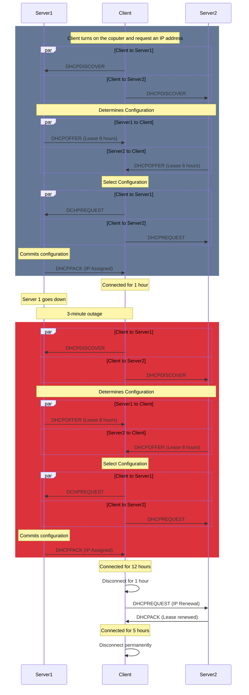

```mermaid

sequenceDiagram
   participant Server1
   participant Client
   participant Server2


%%Client turns on the computer and Request an IP address


rect rgb(100, 120, 150)
note over Client: Client turns on the coputer and request an IP address
par Client to Server1
Client->>Server1 : DHCPDISCOVER
and Client to Server2
Client->>Server2: DHCPDISCOVER
end
note over Server2, Server1 : Determines Configuration
par Server1 to Client
Server1->>Client : DHCPOFFER (Lease 8 hours)
and Server2 to Client
Server2->>Client : DHCPOFFER (Lease 8 hours)
end
note over Client: Select Configuration
par Client to Server1
Client->>Server1: DCHPREQUEST
and Client to Server2
Client->>Server2: DHCPREQUEST
end
note over Server1: Commits configuration
Server1->>Client : DHCPPACK (IP Assigned)
end


%% Client works for 1 hour, connected to DHCP Server 1


Note over Client: Connected for 1 hour


%% Outage for 3 minutes, Server 1 goes down


Note over Server1: Server 1 goes down
Note over Client, Server1: 3-minute outage


%% Client reconnects, Server #1 is down, uses Server #2


rect rgb(220, 50, 60)
par Client to Server1
Client->>Server1 : DHCPDISCOVER
and Client to Server2
Client->>Server2: DHCPDISCOVER
end
note over Server2, Server1 : Determines Configuration
par Server1 to Client
Server1->>Client : DHCPOFFER (Lease 8 hours)
and Server2 to Client
Server2->>Client : DHCPOFFER (Lease 8 hours)
end
note over Client: Select Configuration
par Client to Server1
Client->>Server1: DCHPREQUEST
and Client to Server2
Client->>Server2: DHCPREQUEST
end
note over Server1: Commits configuration
Server1->>Client : DHCPPACK (IP Assigned)
end


%% Client remains active for 12 hours


Note over Client: Connected for 12 hours


%% Client disconnects for 1 hour


Client->>Client: Disconnect for 1 hour


%% Client reconnects after 1 hour, uses DHCP Server 2


Client->>Server2: DHCPREQUEST (IP Renewal)
Server2->>Client: DHCPACK (Lease renewed)


%% Client stays connected for 5 hours and then disconnects permanently


Note over Client: Connected for 5 hours
Client->>Client: Disconnect permanently

``` 